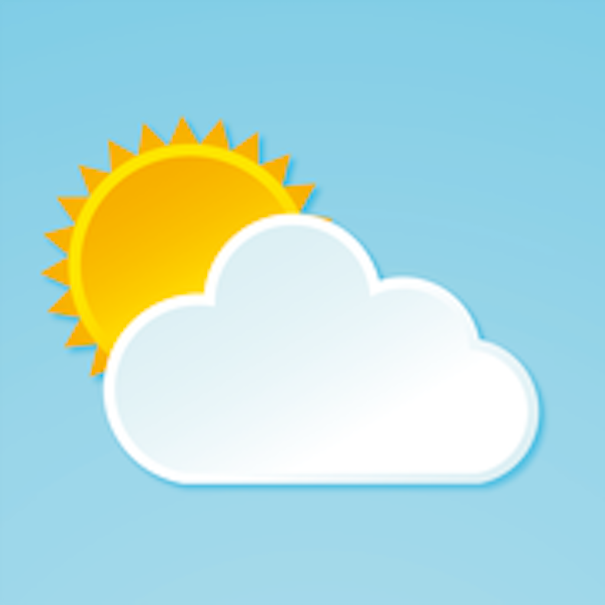
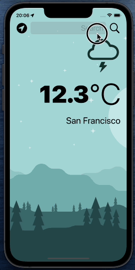

     

<h1 align="center">
  Clima
</h1> 

<h3 align="center">
  Get current weather from where you are or search weather by city
</h3>

<h1 align="center">
     
</h1>

## Technologies and Concepts

* UIKit
* Model-View-Controller or MVC pattern for app development
* Consuming [Open Weather Map API][api] with URLSession
* Core Location to get latitude and longitude from device
* Dark Mode
* Object Oriented Programming
* Delegate Design Pattern
* Swift classes, structures, mutating function, protocols, closures and extensions

[api]: https://openweathermap.org/